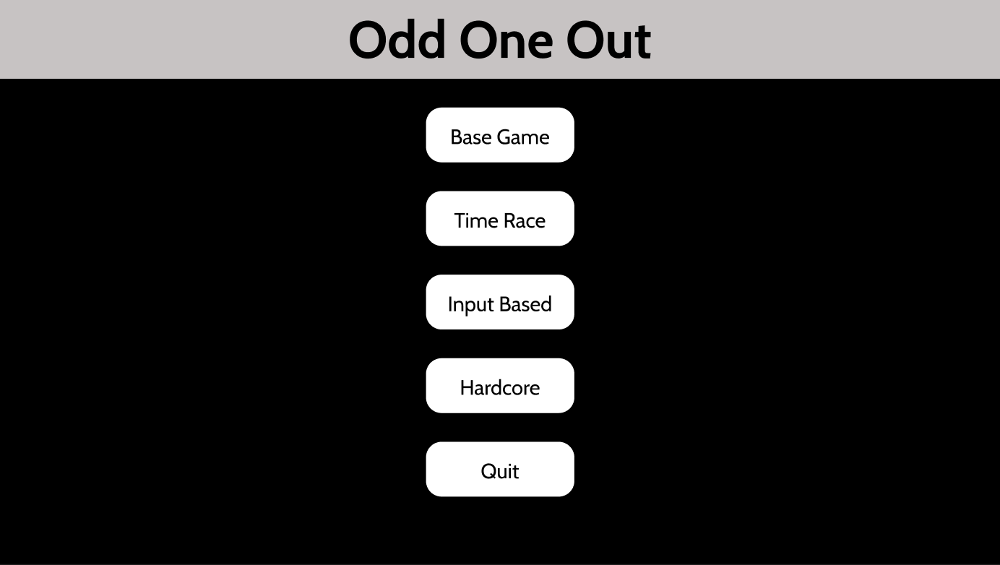

## Overview
In this project, we implement an Odd One Out videogame.
The project's backend is made in Python with the Flask micro web framework, and for the frontend we use HTML and CSS.

The game contains multiple game modes, so the player can choose their favourite ones in the GUI.
After the player has chosen their game mode, their purpose is to find the inappropriate word in the word set.
The purpose of each game mode is different. (see Functional Specification)

You play this game just for the sheer fun of it. This game provides pure enjoyment for individuals aged 2 to 99.
Plus thanks to more game modes, you can choose what is the most suitable for you.
The first game mode would be a base game, where you just select the Odd One Out.
In the next game mode race against time.
In the third game mode you decide how many rounds youu wanna play.
The fourth game mode would be a hardcore game mode.

## Current state

The first and most important purpose of our application is entertainment and spending valuable time. The Odd One Out games are intuitive and
challenging. As scientific publications state, the game helps young children to improve the way of their thinking.
The game is also good for ability testing such as linguistic and analytic skills measuring.

The primary function of the program is entertainment. It offers a diverse range of game modes
that assist young individuals in experiencing the "odd-one-out" phenomenon. The fundamental
mechanics of the game are designed to enhance logical reasoning skills. With its variety,
it provides an exciting and engaging experience that keeps players thoroughly entertained and
less likely to grow bored. This diversity and engagement factor contribute significantly to
the program's appeal and effectiveness in delivering enjoyable gameplay experiences.

## Functional specification of requirement list

| Modul   | ID   | Name       | Description |
| ------- | ---- | ---------- | ----------- |
| Surface | N1   | Main menu  |  The user encounters this screen when they start the program. The main function of the interface is to allow the player to navigate between game modes. A crucial requirement is a clean and clear design.  |
| Surface | N2   | Base game  | The most basic game mode. The user is provided with word quadruples, from which they can choose which one does not belong to the group. The program provides feedback on the success of the guess. |
| Surface | N3   | Time race  |  On the screen, the player can test their speed. The basic game loop remains, but the goal here is to provide as many correct answers as possible within a given time frame. |
| Surface | N4   | Input based| he interface also includes an input field in this screen. The user can decide how many rounds they want to start consecutively. The goal is to make as few mistakes as possible.  |
| Surface | N5   | Hardcore   |   Hardcore mode. The user receives tasks one after another consecutively. However, they cannot make a single mistake. If they provide a wrong answer, the game is over.  |

## Use cases

The software does not handle user profiles. There is no authentication, and there are no user roles. As soon as the program starts, the user appears as a player. In this capacity, they have access to all of the program's game modes. They have unlimited attempts, and they can restart the game as many times as they want. However, there are no admin privileges, and users cannot modify the software's properties.

### Maintenance

The continuous operation and maintenance of the application include addressing program errors, making modifications due to changes in internal requirements, and addressing program or file modification needs arising from changes in environmental conditions. Over time, new categories must be added to the game to maintain interest.

## Current model of business processes

In today's digital age, the necessity of an online Odd-One-Out game has become increasingly evident. 
Such games serve not only as a source of entertainment but also offer several valuable benefits.

Additionally, in an era where remote work and virtual interactions have become the norm, online Odd-One-Out games provide a fun and engaging way to connect with friends and colleagues across distances. 
They promote social interaction and bonding while keeping individuals mentally sharp and engaged.

Moreover, these games are accessible anytime, anywhere, on various devices, making them a convenient choice for people with busy lifestyles. 
They offer a quick mental escape from the stresses of daily life, helping to reduce anxiety and improve overall well-being.

In conclusion, the online Odd-One-Out game has evolved from a simple pastime to a valuable tool for mental exercise, social connection, and relaxation in our fast-paced, interconnected world.

## Model of required business processes

The Odd One Out game is a versatile and valuable educational tool that promotes critical thinking, creativity, and cognitive skills while also making learning enjoyable. It can be employed in various contexts to engage participants, reinforce learning, and foster a deeper understanding of concepts and relationships. Whether in a classroom, a team-building session, or a family gathering, this game has enduring appeal and usefulness.

## Menu plans

On the menu page, users have the opportunity to familiarize themselves with our website's name and make a choice regarding their preferred game mode by making a selection from one of the four available buttons.

In the Base game, players can read a question, such as "which word is the wrong one", and have to choose the right one from four buttons.

In the Time Race mode, players are challenged to answer as many questions correctly as they can within a one-minute time limit. Words will be presented one after another, displayed in four separate buttons.

In the Input based mode, there will be a question and an input field that will indicate how many rounds of the game the player wants to play. Afterward, words will appear one after another.

In the Hardcore mode, the user will receive tasks one after another consecutively. They must choose from among 4 buttons and provide the correct answer each time. A counter will keep track of their successful responses, which will be continuously displayed on the screen. If they make a single mistake, the game is over.

## Easy to read description

The game is built using Python and Flask for the backend, and HTML and CSS for the frontend. It offers multiple game modes to cater to different preferences and age groups.
Players must find the odd word in a set of words based on the chosen game mode, and each mode has a unique objective.
There are no user profiles or authentication, and users can freely play and restart the game.
The software's maintenance involves fixing errors, adapting to changing requirements, and adding new categories to keep it engaging.
In today's digital age, such games serve as a source of entertainment, a tool for mental exercise, and a way to connect with others.
The project's main menu allows users to select their preferred game mode, and each mode has its own rules and challenges.
Overall, this Odd One Out game provides fun and mental stimulation for a wide range of players.

## Standard scenario

- During the runtime of the software, a user appears, the player.
- At the start, the player finds themselves in the menu, where they can choose between different game modes. (The general gameplay descriptions of the various game modes can be found under the "Functional specification of requirement list" section.)
- After a session, the player can choose whether they'd like to start a new round or exit the current screen.

## Dictionary of terms

Microframework: is a term used to refer to minimalistic web application frameworks. It is contrasted with full-stack frameworks. It lacks most of the functionality which is common to expect in a full-fledged web application framework, such as: Accounts, authentication, authorization, roles.

Admin: the administration of a business, organization, etc.

GUI: short for graphical user interface.

Frontend: relating to or denoting the part of a computer system or application with which the user interacts directly.
