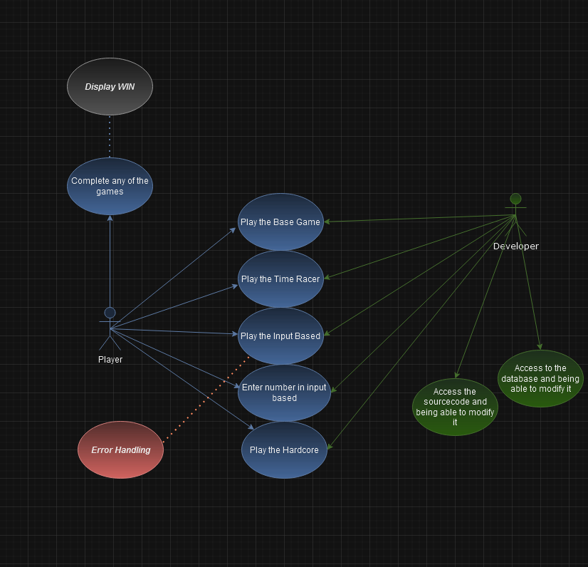
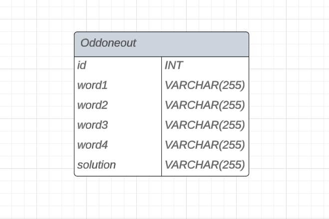

## Purpose of the system

Introduction:
The purpose of the Odd-One-Out game is to create an interactive and entertaining Python-based application that challenges players' observation and analytical skills. The game is designed to present a series of words to the player, with the objective of identifying the item that does not belong to the group based on a predefined rule or pattern.

Game Objective:
The primary goal of the Odd-One-Out game is to engage players in a fun and intellectually stimulating activity.
Within each set, there will be one item that does not conform to the underlying rule or pattern, making it the "odd one out." Players must identify and select this item to advance to the next level or earn points.

Key Features:
- User-Friendly Interface: A clean and intuitive graphical user interface (GUI) will be provided to enhance the overall gaming experience.
- Varied Content: The game will support multiple modes, ensuring a diverse and engaging experience for players.

Target Audience:
The Odd-One-Out game is designed for individuals of all ages who enjoy puzzle-solving and cognitive challenges. It can be a valuable educational tool for enhancing logical reasoning and pattern recognition skills in children and adults alike.

Conclusion:
The Odd-One-Out game aims to provide an engaging and intellectually stimulating gaming experience, fostering cognitive skills and logical reasoning in players. By offering varied content, it seeks to entertain and educate players of all ages.

## Project plan

The first and most important issue is to clarify responsibilites to our project.

In our project there are two roles: Scrum master and Developer.

### What does a Scrum master do?

Scrum master: A Scrum Master is a professional who leads a team using Agile project management through the course of a project. A Scrum Master facilitates all the communication and collaboration between leadership and team players to ensure a successful outcome.

### What does a Developer do?

Software developers design, program, build, deploy and maintain software using many different skills and tools. They also help build software systems that power networks and devices and ensure that those systems remain functional.

### Members in our team

- Richárd Poroszlay: Scrum master, Developer
- Balázs Ádám Sidlóczki: Developer
- Lambert Attila Lipők: Developer
- Zoltán Tar: Developer

### Schedule

We make this project within 3 weeks.

- First week: Declaring functional and requirement specification.
- Second week: Declaring system-plan.
- Third week: Coding the project.

### Achievements

Our goal is to create the application by the end of September. We want it to be presentable to public audience.

## Model of business processes

The project has basically two participants: players and developers.
The players can access and play all the available game modes, whereas the developers can also change the sourcecode and they have access to the database.
The players can not see the database itself nor can not change the code.

We've created a diagram of this process, see it below.

## Requirements

### Functional requirements

- operation in a web environment
- Database management. Storing puzzles in a database.
- Navigation between game modes
- Base game mode
- Time race mode
- Input based mode
- Hardcore mode

### Non-functional requirements

- Clean design
- User-friendly software

## Physical environment

Development Platform: Our program will be implemented in Python using the Flask web framework. Furthermore we will use MySQL database to store the data.

Development tools:
- Python
- Flask
- MySQL
- Visual Studio Code

Operating System: Since our program will be hosted as a web page, the only requirement is to use a web browser with stable internet.

## Database plan

We have decided not to store or utilize user data within our application. Instead, our database structure is designed to store only the essential data necessary for the application's functionality.

The database structure is as follows:
- table name: Oddoneout
- field names:
    - id: INT
    - word1: VARCHAR(255)
    - word2: VARCHAR(255)
    - word3: VARCHAR(255)
    - word4: VARCHAR(255)
    - solution: VARCHAR(255)

In each database record, we will store four words (Word1, Word2, Word3, and Word4), and the Solution for the given set of words will be stored in the 'Solution' field.

